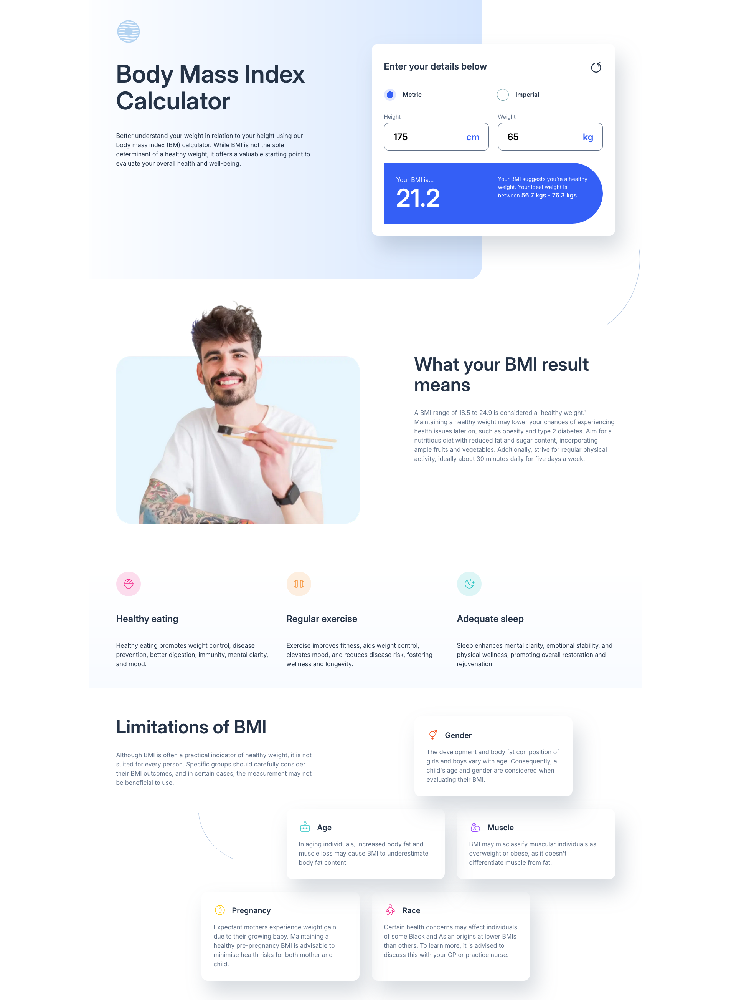

# Frontend Mentor - Body Mass Index Calculator solution

This is a solution to the [Body Mass Index Calculator challenge on Frontend Mentor](https://www.frontendmentor.io/challenges/body-mass-index-calculator-brrBkfSz1T). Frontend Mentor challenges help you improve your coding skills by building realistic projects.

## Table of contents

- [Overview](#overview)
  - [The challenge](#the-challenge)
  - [Screenshot](#screenshot)
  - [Links](#links)
- [My process](#my-process)
  - [Built with](#built-with)
  - [What I learned](#what-i-learned)
  - [Continued development](#continued-development)
- [Author](#author)

## Overview

### The challenge

Users should be able to:

- Select whether they want to use metric or imperial units
- Enter their height and weight
- See their BMI result, with their weight classification and healthy weight range
- View the optimal layout for the interface depending on their device's screen size
- See hover and focus states for all interactive elements on the page

### Screenshot

### Links

- Solution URL: [https://github.com/LukasT1/fm-junior-bmi-calculator]
- Live Site URL: [https://LukasT1.github.io/fm-junior-bmi-calculator/]

## My process

### Built with

- Semantic HTML5 markup
- CSS custom properties
- Flexbox
- CSS Grid
- Desktop-first workflow

### What I learned

Definitely getting more confident working with styles. The JavaScript was a challenge for me, since I haven't worked with it on my own for quite some time.

I was able to build a spaghetti code at first and manged to get it working quite quickly.

I then decied to refactor it into classes and methods. This was quite a challenge but it refresh my memory about many concepts I had previosly learned.

### Continued development

My code is far from perfect. I did not really spend any time thinking about the architecture and then I just went with what I stareted with.

A lot of side effects and the methods are not really following the SOLID principle.

This is what I need to work on in future projects, bettter planning and putting more thought into this in the beggining.

## Author

- Frontend Mentor - [@https://www.frontendmentor.io/profile/LukasT1]
